# {#individual-submissions .figure-slide}

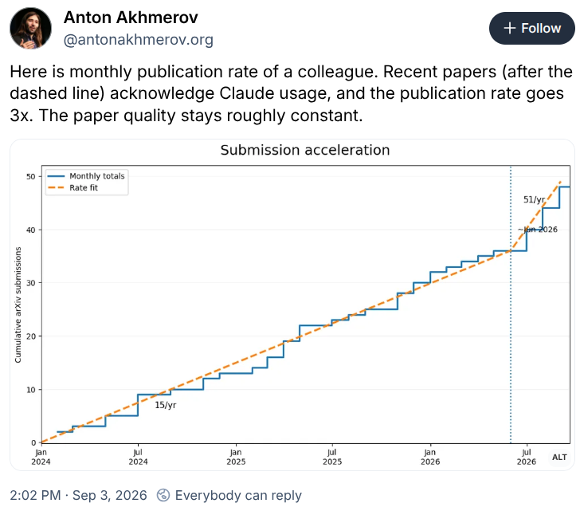{fig-alt="individual submissions"}

# {#arxiv-submissions .figure-slide .has-source}

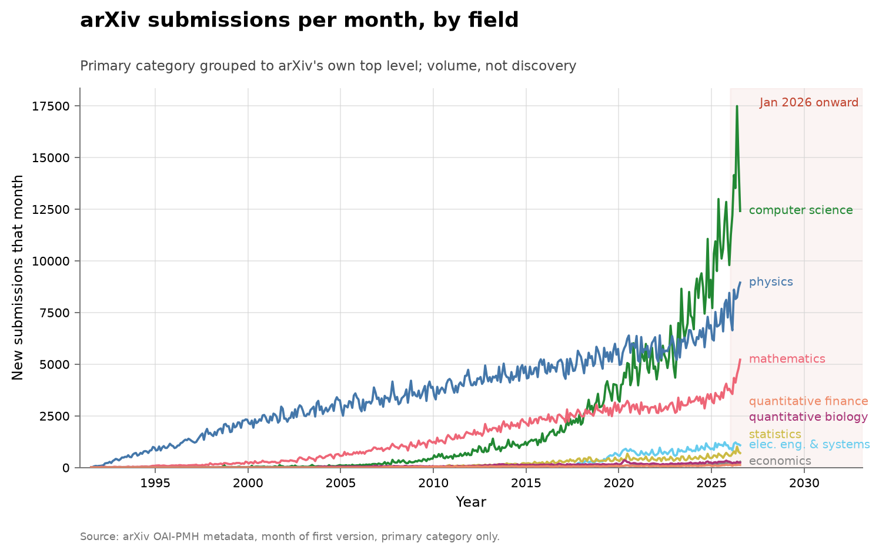{fig-alt="arxiv submissions"}

::: {.figure-source}
Source: [tecunningham/ai-discovery-data · output-arxiv](https://github.com/tecunningham/ai-discovery-data/tree/main/problems/output-arxiv)
:::

# {#physics-submissions .figure-slide .has-source}

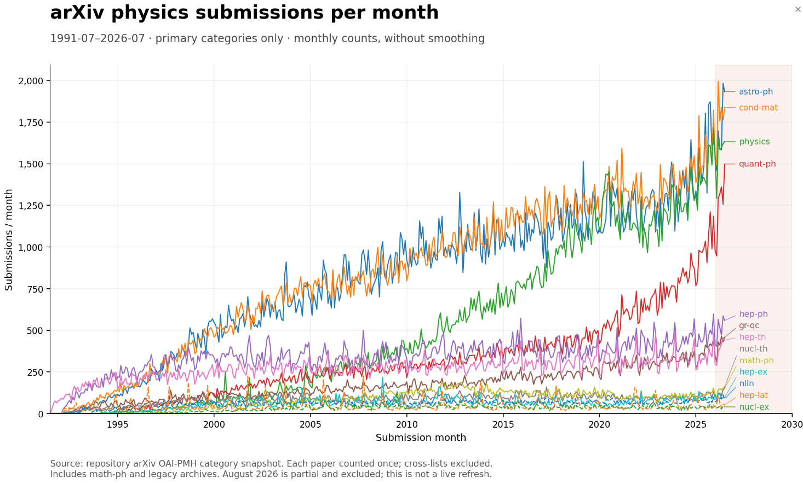{fig-alt="physics submissions"}

::: {.figure-source}
Source: [tecunningham/ai-discovery-data · output-arxiv](https://github.com/tecunningham/ai-discovery-data/tree/main/problems/output-arxiv)
:::

## {#prompting-1 .figure-slide}

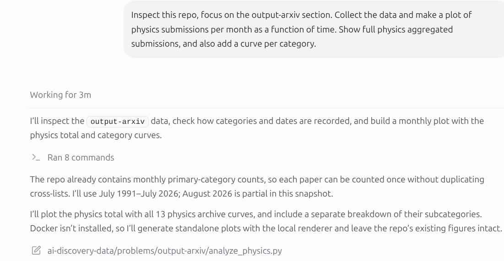{fig-alt="prompting 1"}

## {#prompting-2 .figure-slide}

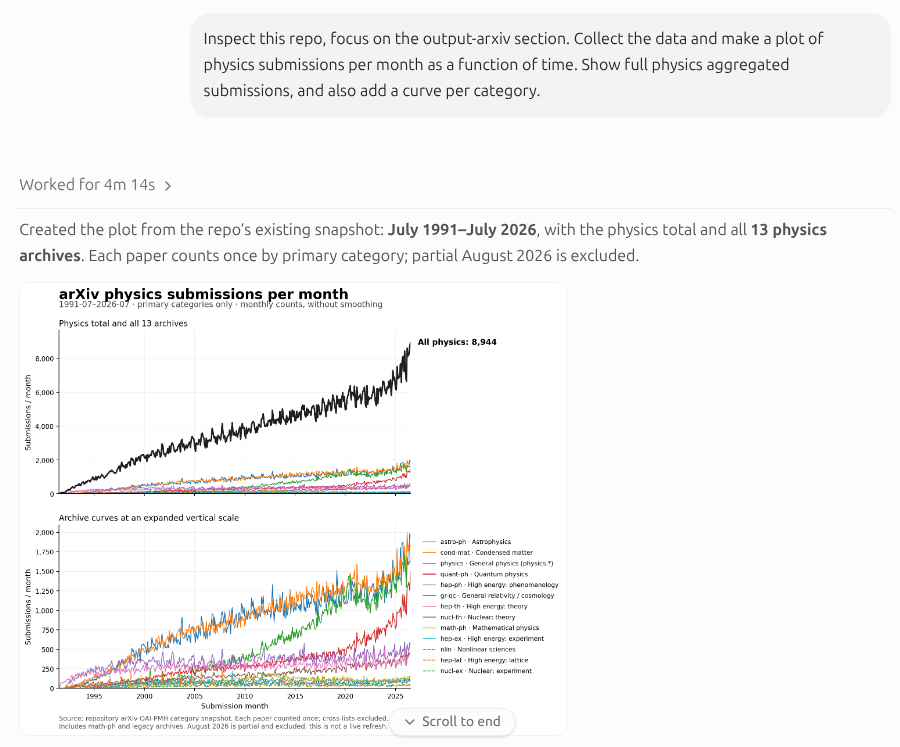{fig-alt="prompting 2"}

# {#arxiv-rejections .figure-slide .has-source}

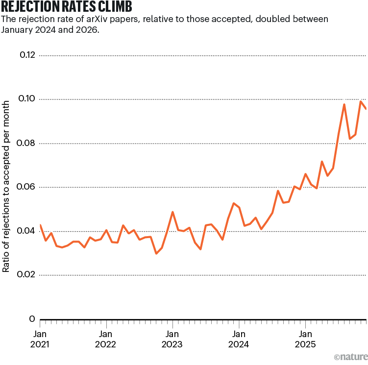{fig-alt="arxiv rejections"}

::: {.figure-source}
Source: [Nature](https://www.nature.com/articles/d41586-025-03967-9?utm_source=chatgpt.com)
:::

# How do we continue to produce high quality research? {.main-question}

# Four ways to work with AI

::: {.incremental}
1. **Chatbot** — Ask a question and use the answer.
2. **Copilot** — Write a function together.
3. **Agent** — Give it a task.
4. **Agentic workflow** — Let it run full research loops.
:::

::: {.notes}
From predicting the next token to producing outputs.
:::


# Comparison between a chatbot and an agent

::::: {.columns}
:::: {.column width="50%"}
<h3>Chatbot</h3>

{.comparison-figure fig-alt="A person exchanges messages with a chatbot."}

“How can I reproduce this figure?”

1. You provide context and ask a question.
2. The chatbot suggests methods or code.
3. You run the code and bring back results.

**You carry out each step.**
::::
:::: {.column .fragment width="50%"}
<h3>Agent</h3>

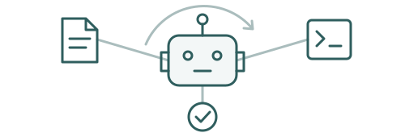{.comparison-figure fig-alt="An agent connected to files, code execution, and result checks."}

“Reproduce this figure in this project.”

1. You define the goal and checks.
2. The agent reads files, writes and runs code.
3. It checks results and revises its work.

**You review the evidence and decisions.**
::::
:::::


::: {.notes}
The model must treat the prompt as a goal rather than merely text to continue.
:::

# What turns an LLM into an agent?

::::: {.columns}
:::: {.column width="50%"}
<h3>What it needs</h3>

- **Prompt** — Your question/instruction.
- **Context** — Papers, data, notes and code.
- **Memory** — Private notes, decisions, and progress.
- **Skills** — Instructions for recurring tasks.
- **Tools** — Access to files, code execution, and tests.
::::
:::: {.column .fragment data-fragment-index="0" width="50%"}
<h3>How it works</h3>

1. **Reason** and inspect the project.
2. **Act** by using tools to carry out the work.
3. **Observe** the results and revise as needed.
4. **Record** the result and how to reproduce it.

::::
:::::

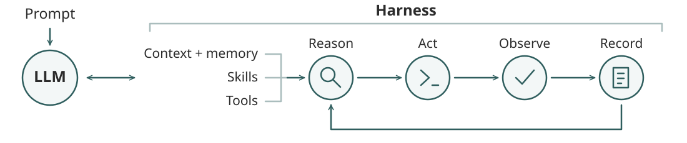{.fragment data-fragment-index="1" width=1100 height=230 fig-alt="A prompt guides the LLM, which works with a harness that manages context, memory, skills, tools, and the inspect, act, check, record loop."}


::: {.notes}
This progression was led by trying to overcome the limitations of LLMs due to their context window.
They do not load all the information at once, but can access it in a structured way.
Limited and useful context.
Memory about the project and user patterns.
Skills for tasks you do more than twice.
Tool calling turned natural language into reliable actions.
Because it can write code, it can check that stuff works: references.

:::

## {#openai-paper-2022 .figure-slide}

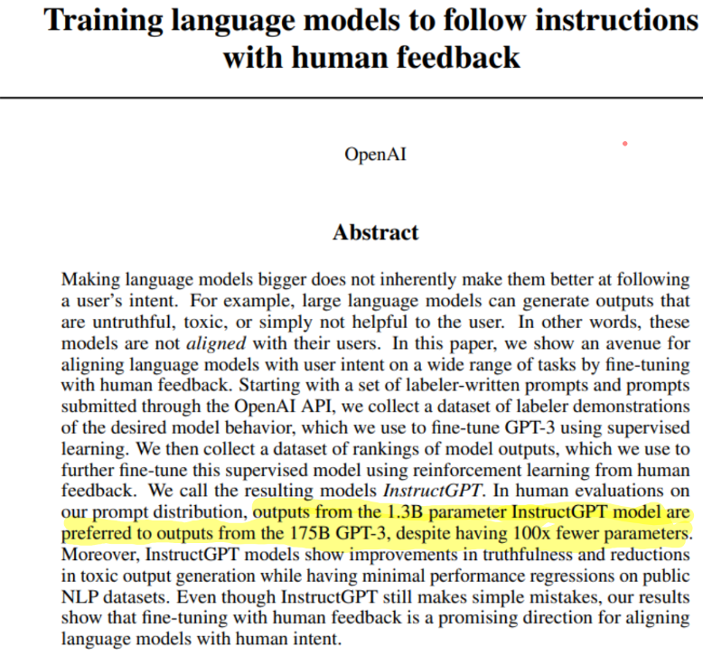{fig-alt="OpenAI paper, 2022."}

# Demo {.example-inverted background-color="#20262e"}

::: {.small}
**Tam & Kane · Probing Fermi sea topology by Andreev state transport**

[arXiv:2210.08048](https://arxiv.org/pdf/2210.08048) · Reproduce and extend a paper.
:::

```text
Create a subfolder and work there. Your job is to read arxiv: 2210.08048, write a
research project codebase that reproduces the results using tight-binding simulations,
 and extends the conductance simulation for a normal hamiltonian with random onsite disorder.
Report back with an html summary.
```

::: {.notes}

:::

# How I structure my work {.workflow-overview}

::::: {.columns}
:::: {.column width="50%"}
<h3>ALL my projects live in Projects/</h3>

```text
Projects/
├── spin-qubit/
├── another-project/
└── ...
```
::::
:::: {.column width="50%"}
<h3>My workflow for every project</h3>

::: {.incremental}
1. **Create** a project from my template, with its own Git repository and environment.
2. **Start Codex inside it**, with the README, notes, and a concrete task.
3. **Review** the outputs, scientific checks, and Git diff; commit the changes I accept.
4. **Resume** from saved decisions and next steps in `notes/`.
:::
::::
:::::

**↓ Explore the project:** project structure → working session

::: {.notes}
I don't want to give codex access to everything I own.
Every project is self-contained and has all the context a collaborator would need.
:::

## 1. Organize the project {.repo-detail}

::::: {.columns}
:::: {.column width="50%"}
<h3>Projects / spin-qubit</h3>

```text
spin-qubit/
├── .git/
├── README.md
├── AGENTS.md
├── pyproject.toml
├── pixi.lock
├── code/
│   ├── spin_qubit_package/
│   │   ├── reusable_modules/
│   │   └── tests/
│   ├── simulations/
│   ├── results/
├── data/
├── manuscript/
├── notes/
└── slides/
```
::::
:::: {.column width="50%"}
<h3>One reproducible research workspace</h3>

::: {.incremental}
- **Package** — `spin_qubit_package/` holds reusable models, solvers, and plotting.
- **Scripts** — `simulations/` runs calculations; `results/` analyses saved data. Both import the package.
- **Tests** — Check known limits and catch regressions.
- **Environment** — `pyproject.toml` defines dependencies and tasks; `pixi.lock` pins versions.
- **Research record** — Save data, manuscript, notes, and slides together; document commands in the README and track changes with Git.
:::
::::
:::::

Repetitive task → Use a **skill** to set up a project structure!

::: {.notes}
Important to have a research template -> skill.
Reusable logic goes into a package, that we review and test.
:::

## 2.Start, check, and leave a record {.repo-detail}

::::: {.columns}
:::: {.column width="50%"}
<h3>Start inside the project</h3>

```bash
cd ~/Projects/spin-qubit
codex
```

```text
Inspect this repo, focus on the
tight-binding implementation.
Generalize the code to ...
Verify the result by ...

```
::::
:::: {.column width="50%"}
<h3>Process</h3>

::: {.incremental}
1. **Choose a model**
2. **Give a task** — Define deliverable and checks.
3. **Ask questions** — Ask for figures, explanations.
4. **Prompt benchmarks** — Ask for tests.
5. **Ask for a record** — Write a summary.
6. **Check the diff** — If possible, inspect the Git diff.
7. **Commit** — Save the changes for later.
:::
::::
:::::

Prefer **focused sessions**, each with a clear goal.

::: {.notes}
Starting Codex in a directory provides a working location, not an isolation guarantee.
:::

## 3. Finalize the project {.repo-detail}

::::: {.columns}
:::: {.column width="50%"}
What I do:

::: {.incremental}
- Discuss results with collaborators.
- Clean up the code and notes.
- Have my collaborators prompt the project.
- Disclose the use of AI.
:::
::::

:::: {.column width="50%"}
The questions I still have:

::: {.incremental}
- Should I read every line of code?
- Can another agent review it for me?
- How many checks are enough to trust the result?
- What results are worth publishing?
:::
::::
:::::

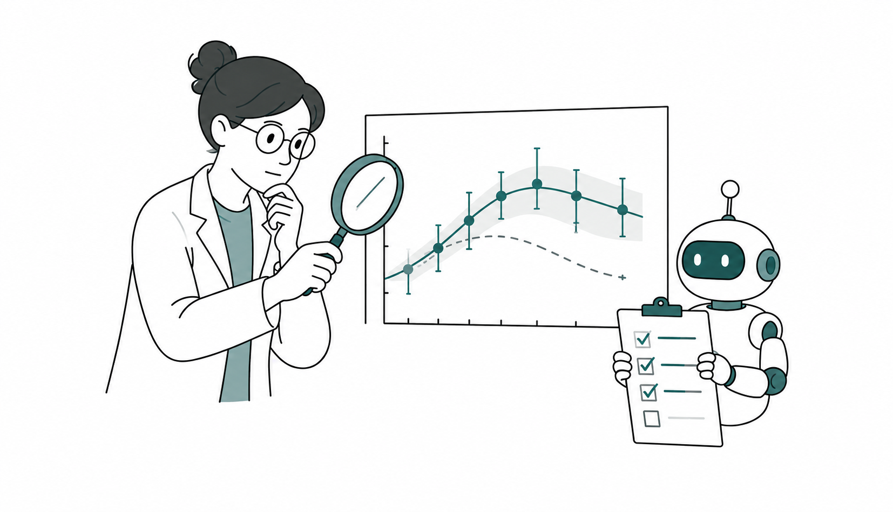{width=1100 height=270 fig-alt="A researcher and an agent scrutinize research plots, with unresolved questions prompting further review before documenting results."}

**Producing outputs is easier than knowing whether to trust them.**

::: {.notes}
A project structure makes it easier to review and reproduce results, making research more reliable.
This is a big difference with using web-based agents.
With this workflow I can operate at various levels of research...
:::

# What can become an agent project?

::: {.incremental}
1. **Creating a website**
2. **Filling out reimbursement forms**
3. **Scraping a website for data**
4. **Collecting literature from a chat**
5. **Reviewing someone else's code**
6. **Launching cluster simulations**
7. **Reproducing a figure from a paper**
8. **Generalizing an algorithm**
9. **Testing an idea**
:::

A project can be **anything with inputs and a deliverable**.


::: {.notes}
One can tackle big scientific problems, and also mundane tasks.
Skills help!
:::

# How to get started

::::: {.columns}
:::: {.column width="50%"}
<h3>Install and connect</h3>

<ol>
<li class="fragment" data-fragment-index="0"><strong>Choose an interface</strong> — An agent app or terminal CLI.</li>
<li class="fragment" data-fragment-index="1"><strong>Sign in </strong> — Pay a subscription.</li>
<li class="fragment" data-fragment-index="2"><strong>Prepare your tools</strong> — Ask the agent to install Git, Python, Pixi, LaTeX, etc.</li>
<li class="fragment" data-fragment-index="3"><strong>Open a project folder</strong> — Use a skill to organize it.</li>
</ol>
::::
:::: {.column .fragment data-fragment-index="4" width="50%"}
```{=html}
<div class="r-stack docs-preview-stack">
  <div class="fragment fade-out" data-fragment-index="5">
    <div class="docs-preview-frame"><a href="https://learn.chatgpt.com/docs" target="_blank" rel="noopener">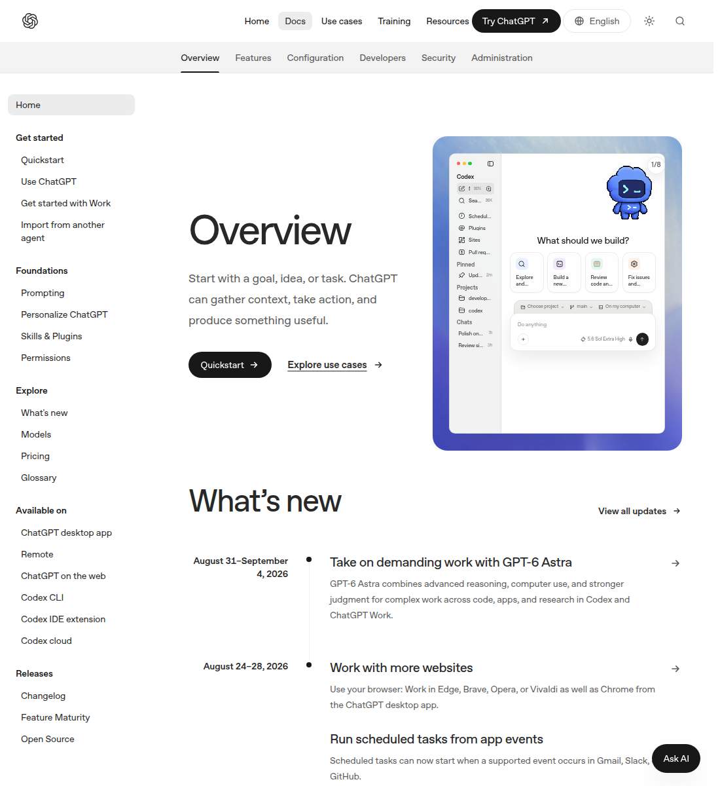</a></div>
    <a href="https://learn.chatgpt.com/docs" target="_blank" rel="noopener">OpenAI documentation ↗</a>
  </div>
  <div class="fragment" data-fragment-index="5">
    <div class="docs-preview-frame"><a href="https://code.claude.com/docs/en/quickstart" target="_blank" rel="noopener">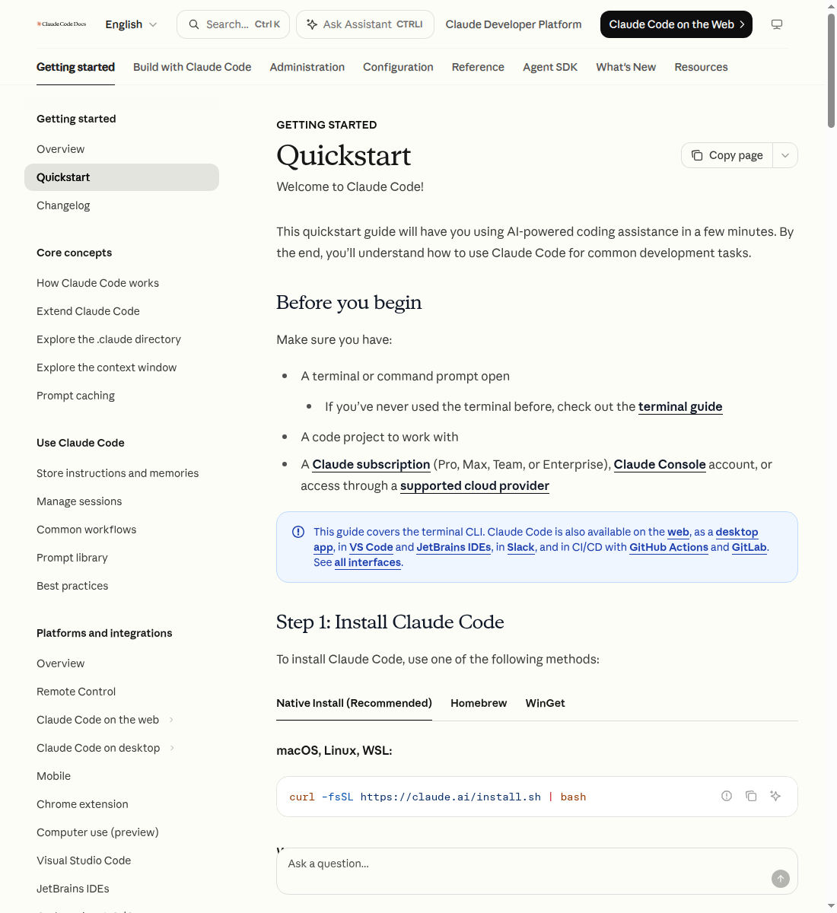</a></div>
    <a href="https://code.claude.com/docs/en/quickstart" target="_blank" rel="noopener">Claude Code quickstart ↗</a>
  </div>
</div>
```

::::
:::::

## {#terminal-bench-science-0.1 .figure-slide .has-source .benchmark-figure}

{fig-alt="Terminal-Bench Science 0.1: resolution rate versus API cost, including GPT-6 Astra."}

::: {.figure-source}
Terminal-Bench Science 0.1 tests whether agents can complete scientific research workflows using code and terminal tools, including analyzing data, running simulations, and fitting models.

Source: [OpenAI, GPT-6 Astra launch results](https://openai.com/index/gpt-6-astra/)
:::

## {#frontiermath-tier-4-v2 .figure-slide .has-source .benchmark-figure}

.png>){fig-alt="FrontierMath Tier 4 (v2): accuracy versus API cost, including GPT-6 Astra."}

::: {.figure-source}
FrontierMath Tier 4 tests advanced mathematical reasoning on exceptionally difficult problems.

Source: [OpenAI, GPT-6 Astra launch results](https://openai.com/index/gpt-6-astra/)
:::

# Things I do not have time to talk about

- How to deal with data privacy?
- How to create skills?
- How to set up remote control and launch agents on a server/cluster?
- How to document the use of AI in research?
- What are the costs of using agents in research?
- How to stay up to date with all this?

Questions?
