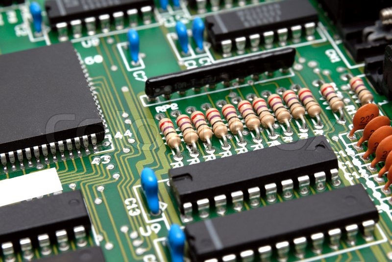
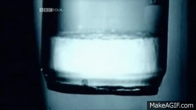
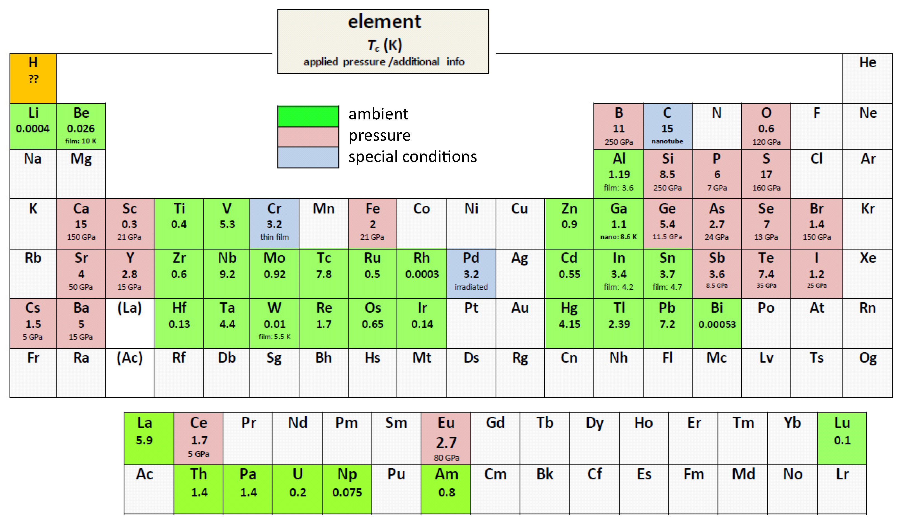
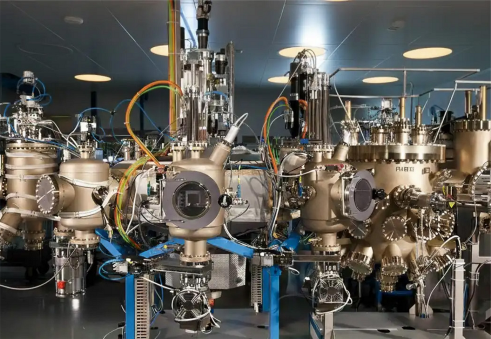
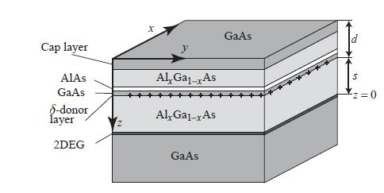
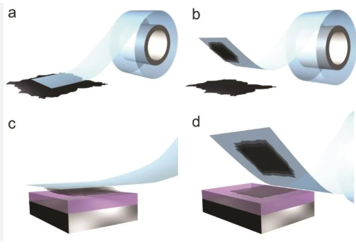
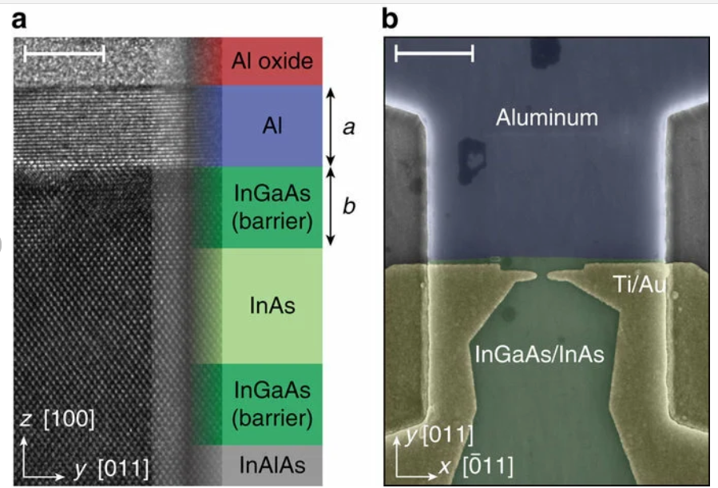
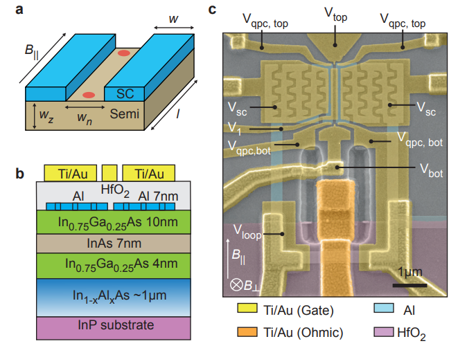

## Phases of matter

<!-- Main idea: Matter can look familiar from the outside: solid, liquid, gas. -->

````{=html}
<div class="matter-photo-grid" aria-label="Static photo of solid, liquid, and gas">
  
</div>
````

::: {.notes}
**Emotion:** Familiarity

A good beer has all three phases we learned in school.
Ice is a solid because it keeps its shape, beer is liquid because it flows, and gas spreads out.

**Connector:** But if we look closer, each phase is really about how atoms move.
:::

## Phases of matter

<!-- Main idea: School teaches us the basic phases of matter, but condensed matter physics goes much deeper. -->

````{=html}
<div class="matter-phases" aria-label="Atoms in gases, liquids, and solids">
  <div class="matter-phase">
    <div class="matter-phase-title">Solid</div>
    <iframe src="animations/matter-solid.html" title="Atoms in a solid vibrating in place"></iframe>
    <div class="matter-phase-example">Example: ice</div>
  </div>
  <div class="matter-phase">
    <div class="matter-phase-title">Liquid</div>
    <iframe src="animations/matter-liquid.html" title="Atoms in a liquid moving past each other"></iframe>
    <div class="matter-phase-example">Example: water</div>
  </div>
  <div class="matter-phase">
    <div class="matter-phase-title">Gas</div>
    <iframe src="animations/matter-gas.html" title="Atoms in a gas moving freely"></iframe>
    <div class="matter-phase-example">Example: steam</div>
  </div>
</div>
````

::: {.notes}
**Emotion:** Familiarity

This classification is useful, but it is only the beginning.

Condensed matter physics asks what happens when many atoms and electrons interact together.
Under different conditions, matter can organize itself in different ways, giving rise to different phases.

**Connector:** For example a solid may look very boring, but if we look in detail the story becomes much richer than “it keeps its shape.”
:::

## The solid state

<!-- Main idea: Solids are often classified by how electrons move through them. -->

````{=html}
<div class="solids-theory" aria-label="Three electronic behaviors in solids">
  <span class="fragment theory-marker stage-1" data-fragment-index="1"></span>
  <span class="fragment theory-marker stage-2" data-fragment-index="2"></span>
  <span class="fragment theory-marker stage-3" data-fragment-index="3"></span>
  <span class="fragment theory-marker stage-4" data-fragment-index="4"></span>
  <span class="fragment theory-marker stage-5" data-fragment-index="5"></span>

  <div class="two-column-frame" aria-hidden="true">
    <div class="theory-column">
      <div class="column-title">Insulator</div>
      <div class="column-space"></div>
    </div>
    <div class="theory-column">
      <div class="column-title">Conductor</div>
      <div class="column-space"></div>
    </div>
  </div>

  <div class="animation-card insulator-card">
    <iframe class="clean-iframe" src="animations/solid-insulator.html" title="An insulator lattice with localized electrons"></iframe>
    <div class="animation-example">Example: diamond </div>
  </div>

  <div class="animation-card conductor-card">
    <iframe class="clean-iframe" src="animations/solid-conductor.html" title="A conductor lattice with moving electrons"></iframe>
    <div class="animation-example">Example: copper wire</div>
  </div>

  <div class="chip-transition">
    
    <div class="chip-caption">Transistor, invented in 1947.</div>
  </div>

</div>
````

Materials that can switch between both behaviors are called semiconductors.
This property makes them the basis of modern electronics.

::: {.notes}
**Emotion:** Curiosity

A minimal way to classify solids is by how easily electrons can move through the material.

In an insulator, electrons are stuck, so current does not flow.
In a conductor, electrons move easily, so electrical current flows.

When we learned how to control whether a material conducts or not, the entire world changed.

A semiconductor is a material that sits somewhere in between, and importantly, we can control it, which makes it the basis of modern electronics.

**Connector:** But conductors, insulators, and semiconductors are only the first few examples of what solids can be.
:::

## In reality there are plenty of other phases

<!-- Main idea: Solids can host many different electronic phases. -->

:::: {.columns}
::: {.column width="42%"}
- Superfluids
- Liquid crystals
- Magnets
- Superconductors
- Topological materials
:::

::: {.column width="58%"}
<div class="other-phases-gallery" aria-label="Examples of other phases">
  <figure class="other-phases-shot">
    
    <figcaption class="other-phases-caption">Superfluid helium</figcaption>
  </figure>
  <figure class="other-phases-shot other-phases-replacement fragment" data-fragment-index="1">
    
    <figcaption class="other-phases-caption">Magnetism</figcaption>
  </figure>
</div>
:::
::::

\;

Temperature, magnetic fields, and electric fields are knobs that help us change from one phase to another.

::: {.notes}
**Emotion:** Surprise

Electrons can organize in many collective ways.

A striking phase is a superfluids: a liquid that does not freeze, and conducts instead.
They can form liquid crystals, which helps us make modern TVs.
They can produce magnetism.
They can also enter quantum phases where current flows in very unusual ways.

So a solid is not just a solid, we just need to look at what the electrons do.
Just like when we freeze water we get ice, we can change temperature or B field and transform one phase into another.

**Connector:** Among all these possible phases, two are especially important for my work.
:::

## My two favorite phases

<!-- Main idea: Superconductors and topological materials both involve unusual ways for current to flow without ordinary resistance. -->

````{=html}
<div class="favorite-phases" aria-label="Superconductors and topological materials">
  <span class="fragment phase-marker phase-stage-1" data-fragment-index="1"></span>
  <span class="fragment phase-marker phase-stage-2" data-fragment-index="2"></span>
  <span class="fragment phase-marker phase-stage-3" data-fragment-index="3"></span>
  <span class="fragment phase-marker phase-stage-4" data-fragment-index="4"></span>

  <div class="two-column-frame" aria-hidden="true">
    <div class="phase-column">
      <div class="column-title">Superconductors</div>
      <div class="column-space"></div>
    </div>
    <div class="phase-column">
      <div class="column-title">Topological materials</div>
      <div class="column-space"></div>
    </div>
  </div>

  <div class="phase-card superconductor-card">
    <iframe class="clean-iframe" src="animations/solid-superconductor.html" title="A superconductor lattice with electrons moving in pairs"></iframe>
    <div class="animation-example">Example: aluminum at very low temperature</div>
    <div class="animation-example">Discovered in Leiden, The Netherlands in 1908</div>
  </div>

  <div class="phase-card topological-card">
    <iframe class="clean-iframe" src="animations/quantum-hall-insulator.html" title="A topological material with edge currents"></iframe>
    <div class="animation-example">Example: MnBi2Te4</div>
    <div class="animation-example">Discovered in Grenoble, France in 1980</div>
  </div>
</div>
````

<div class="phase-transition-claim">Both conduct perfectly!</div>

Both need extremely low temperatures!

::: {.notes}
**Emotion:** Fascination

The two phases I care most about are superconductors and topological materials.

A superconductor is a material that we'd normally see as a metal (Al) and then it changes as it cools down.
It is special because current can flow through the bulk without resistance, but electrons cannot travel alone.

A topological material is another material where charges move perfectly, but the interior of the material acts like an insulator.

Both phases are connected to current flowing without the usual losses, which is surprising considering that their properties are universal across materials and scales.
They achieve this in different ways, mechanisms that we more or less understand.

**Connector:** The natural next question is whether we can combine these two ideas.
:::

## My research: can we design a topological superconductor? {.full-screen-slide}

<div class="full-screen-question">Can we design a topological superconductor?</div>

::: {.notes}
**Emotion:** Ambition

PhD research was: can we design a topological superconductor?
This would be a phase that combines superconductivity with topological protection.

It is exciting because the prediction says we will find results that are interesting beyond condensed matter physics.
Considerable effort into qubits.
I find it fundamentally interesting: 2 things we know, so obviously the combination should be alright.

**Connector:** This sounds like a beautiful target, but it is extremely demanding.
:::

## Why can’t we just find one?

<!-- Main idea: Topological superconductivity requires many ingredients to work together at once. -->

:::: {.columns}
::: {.column width="52%"}
Too many requirements:

::: {.incremental}
- Superconductivity needs low magnetic fields
- Topological materials usually need high magnetic fields
- We want clear experimental signatures
- We want to be able to control/change it
:::
:::

::: {.column width="48%"}
{alt="Periodic table highlighting superconducting and topological materials"}
:::
::::

::: {.notes}
**Emotion:** Frustration

To make a useful topological superconductor, we need several things at the same time.

Superconductivity needs low magnetic fields
Topological materials usually need high magnetic fields
We want clear experimental signatures
We want to be able to control/change the number of electrons, the phase
Above all we need clean samples, that are reproducible

Getting all of this in one material is very hard.

**Connector:** One possible strategy is to search for a material where all these ingredients naturally appear together.
:::

## Approach 1: discover or synthesize the right material

<!-- Main idea: One route is to make new materials by combining chemical elements and tuning their properties. -->

:::: {.columns}
::: {.column width="45%"}

TODO list:

1. Choose elements
2. Grow crystals
3. Tune composition, pressure, strain, or density
4. Look for the desired phase
:::

::: {.column width="55%"}
{width="100%"}
:::
::::

::: {.notes}
**Emotion:** Determination

The traditional route is materials discovery.
We combine chemical elements, grow crystals, tune composition, apply strain, change pressure, or modify the electron density.
Then we ask whether the desired phase appears.
This approach has produced many extraordinary quantum materials.

It is difficult because cooking up a topological superconductor is like preparing a dessert that needs to be frozen and flambeed at the same time.

**Analogy:** Cooking.

**Story:** My bachelors experience.

**Connector:** A major change came when we learned to make materials so thin that interfaces became central.
:::

## The discovery of 2D materials

<!-- Main idea: Two-dimensional materials changed the design problem by making surfaces, interfaces, and gates much more powerful. -->

:::: {.columns}

::: {.column width="50%"}
<div class="discovery-figure">
  <div class="discovery-title">Semiconductor stacks</div>
  
  <div class="discovery-caption">Technology from the 70s</div>
</div>
:::

::: {.column width="50%"}
<div class="discovery-figure">
  <div class="discovery-title">Exfoliation</div>
  
  <div class="discovery-caption">Method invented in 2004</div>
</div>
:::

::::

We now know how to create "sheets" of different materials!

::: {.notes}
**Emotion:** Wonder

The discovery of 2D materials opened a different way of thinking.
These are materials that can be only one or a few atoms thick.

Left: MBE machine can make these very well, mostly semiconductors.
Right: Some other materials can be taken in layers from a bulk piece.

This is the first hint of the answer: if the desired phase is too hard to find naturally, maybe we can build the conditions for it.

**Connector:** And once interfaces become central, a surprising quantum effect becomes a design tool.
:::

## Plot twist: the proximity effect ✨

<!-- Main idea: A material can borrow superconducting behavior from a neighboring superconductor. -->


````{=html}
<div class="hybrid-device-animation">
  <iframe src="animations/superconductor-semiconductor-interface.html" title="A superconductor touching a semiconductor, with paired electrons moving into the semiconductor"></iframe>
</div>
````

A semiconductor that is atomically close to a superconductor starts superconducting!

A quantum effect that allows materials to share properties over some distance!

::: {.notes}
**Emotion:** Revelation

**Question:** What do you think happens when a semiconductor touches a superconductor?

Clearly when ice meets water, it melts, but solids do not do that!
A metal conducts. An insulator blocks current. A semiconductor can be tuned. A superconductor carries current without resistance.
But quantum materials have a surprise for us: when two materials touch cleanly enough, their identities are not completely separate.

A boundary can be a place where quantum behavior is shared, and this is called the proximity effect.
If a semiconductor is placed in very good contact with a superconductor, superconducting correlations can leak into the semiconductor.
The semiconductor can inherit part of its behavior.

That is the plot twist: we do not need to find a semiconductor that is naturally superconducting.
We can place it next to a superconductor and make it behave superconductingly, while keeping the things that make semiconductors useful — especially the ability to control them with gates.

**Connector:** Once materials can borrow properties from their neighbors, the design strategy changes completely.
:::

## Approach 2: build a hybrid device

<!-- Main idea: Hybrid devices use proximity to assemble the desired phase from separate ingredients. -->

{width="72%"}

::: {.notes}
**Emotion:** Inventiveness

This gives us a second strategy.

Instead of searching for one material that naturally has every property we need, we build a device where each part contributes something.

The semiconductor gives us control. We can tune the number of electrons using electric gates.

The superconductor gives us superconductivity IN the semiconductor through the proximity effect.
The interface is the place where the transfer happens and the geometry of the device determines where electrons can move.

This is why hybrid devices are so powerful.
The phase is not only discovered. It is assembled.

If the interface is clean, it lets the quantum behavior transfer.
If it is messy, it can weaken the effect or create confusing signals.

**Connector:** The most famous example of this assemble-the-ingredients strategy is the one used for topological superconductivity
:::

## Example: planar topological superconductor

{width="50%"}

::: {.notes}
**Emotion:** Clarity

This is one concrete way to build a hybrid device.

The semiconductor sits between superconducting contacts, and gates and geometry help shape where the electrons move.

The point is not only the final device. The point is that each ingredient has a role.

**Connector:** From here, we can ask what the device does when we tune it into the right regime.
:::

## Designing new phases {.final-stack-slide auto-animate=true auto-animate-easing="cubic-bezier(0.18, 0.84, 0.22, 1)" auto-animate-duration="1.1"}

<!-- Main idea: Quantum phases can be engineered using materials, interfaces, gates, and geometry. -->

````{=html}
<div class="final-stack-scene final-stack-spread" aria-label="Three separate material layers">
  <div class="final-material-row">
    <div class="final-material-card rectangle-1" data-id="rectangle-1"></div>
    <div class="final-material-card rectangle-2" data-id="rectangle-2"></div>
    <div class="final-material-card rectangle-3" data-id="rectangle-3"></div>
  </div>
</div>
````

## Designing new phases {.final-stack-slide auto-animate=true auto-animate-easing="cubic-bezier(0.18, 0.84, 0.22, 1)" auto-animate-duration="1.1"}

**could** be possible thanks to the proximity effect

````{=html}
<div class="final-stack-scene final-stack-built" aria-label="Three material layers stacked on top of each other">
  <div class="final-material-stack">
    <div class="final-stack-halo" aria-hidden="true"></div>
    <div class="final-material-card rectangle-3" data-id="rectangle-3"></div>
    <div class="final-material-card rectangle-2" data-id="rectangle-2"></div>
    <div class="final-material-card rectangle-1" data-id="rectangle-1"></div>
  </div>
</div>
````

## Designing new phases {.final-stack-slide auto-animate=true auto-animate-easing="cubic-bezier(0.18, 0.84, 0.22, 1)" auto-animate-duration="1.1"}

````{=html}
<div class="final-stack-scene final-stack-columns" aria-label="Difficulties of stacking materials next to the assembled stack">
  <div class="final-stack-difficulties">
    <div class="final-difficulty-title">But stacking materials is not magic</div>
    <ul>
      <li class="fragment" data-fragment-index="1">Interfaces must be extremely clean</li>
      <li class="fragment" data-fragment-index="2">Each layer can disturb the others</li>
      <li class="fragment" data-fragment-index="3">The useful signal can be tiny</li>
      <li class="fragment" data-fragment-index="4">Geometry and disorder matter</li>
    </ul>
  </div>
  <div class="final-material-stack">
    <div class="final-stack-halo" aria-hidden="true"></div>
    <div class="final-material-card rectangle-3" data-id="rectangle-3"></div>
    <div class="final-material-card rectangle-2" data-id="rectangle-2"></div>
    <div class="final-material-card rectangle-1" data-id="rectangle-1"></div>
  </div>
  <div class="final-thank-you fragment" data-fragment-index="5">Thank you!</div>
</div>
````

::: {.notes}
**Emotion:** Celebration

We started with the simple school picture: gases, liquids, and solids.

But inside solids, electrons can form many different phases.

Superconductors and topological materials show us unusual ways for current to move without ordinary resistance.

Topological superconductors are exciting because they may host exotic boundary states.

They are difficult to realize in a single natural material.

But hybrid devices, proximity effects, and 2D platforms give us a way to design them.

The dream is to build quantum matter deliberately, using materials, interfaces, gates, and geometry.

Thank you.

**Connector:** Questions.
:::
