:::{.full-screen-slide}
:::{.full-screen-question}
Can we tell topology from quantum transport?
:::
:::

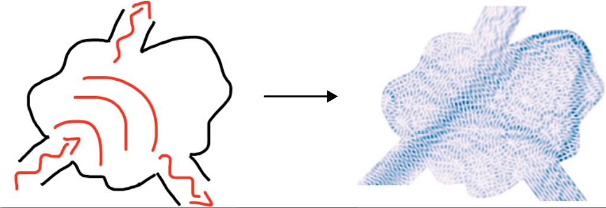{width=40%}

::: {.caption}
Figure from Kwant

:::

::: {.reference-stack}

[Waintal et al. 2024]{.reference}

:::

# Transport tells how samples conduct

::: {.columns}
::: {.column width="50%"}
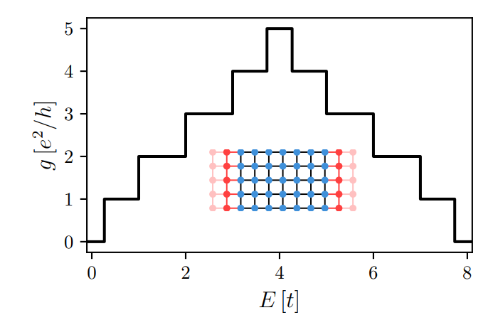{width=80%}

Conductance in a metallic wire
:::
::: {.column width="50%"}
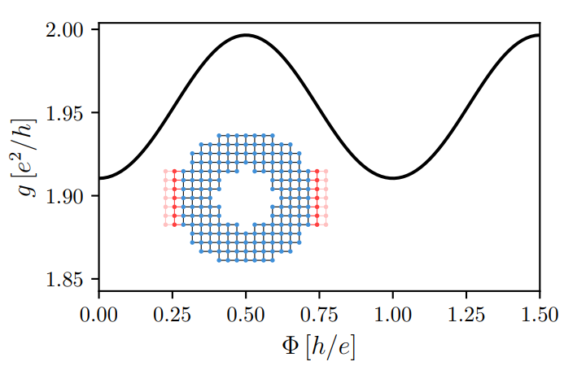{width=80%}

Aharonov-Bohm conductance oscillations
:::
:::

::: {.reference-stack}
[Waintal et al., 2024]{.reference}
:::

## Topological edge states conduct

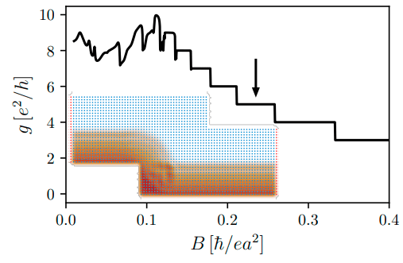{width=35%}

::: {.caption}

Quantum Hall sample
:::

\

**Advantages**:

- It does not require translational invariance
- It is efficient to compute

::: {.reference-stack}
[Waintal et al., 2024]{.reference}
:::

# Higher order topological insulators

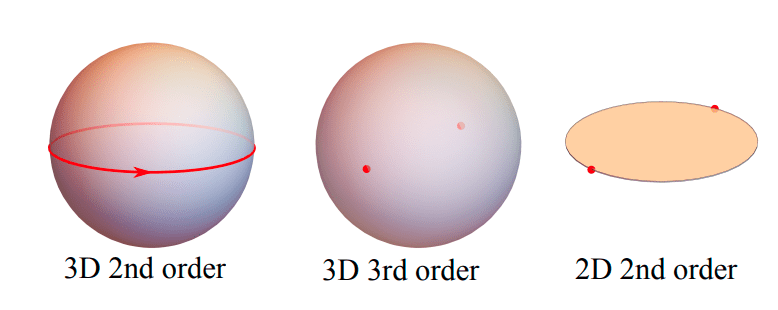{width=50%}

\

**Properties**:

- Low dimensional surface modes
- Protected by spatial symmetries
- Unclear how robust to disorder they are

::: {.reference-stack}
[Khalaf et al. (2018),]{.reference}
[Schindler et al. (2018)]{.reference}
:::

---

:::{.full-screen-slide}
:::{.full-screen-question}
Can we tell topology from quantum transport if surface modes do not propagate?
:::
:::

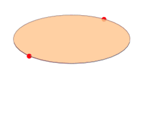{width=15%}

:::{.caption}
2nd order TI protected by $C_2$ and $\mathcal{C}$
:::

## Disordered Axion insulator

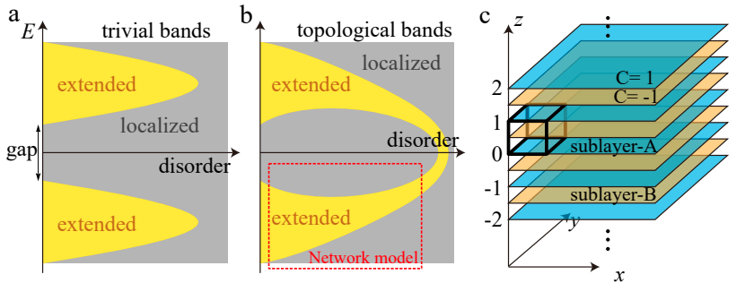{width=55%}

Computing trivial and topological phases requires a convenient construction

::: {.reference-stack}
[Song et al. 2021]{.reference}

:::

## Predictions with disorder are hard to test

::: {.columns}
::: {.column width="50%"}
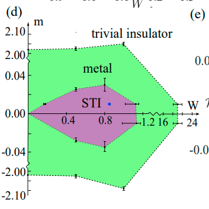{width=60%}

:::
::: {.column width="50%"}
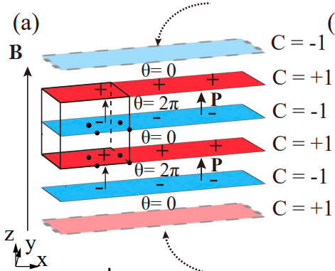{width=60%}

:::
:::

There are topological phases that do not exist in clean systems, but **only in disordered ones!**

::: {.reference-stack}
[Chen et al. 2025]{.reference}

:::

# Landauer's scattering formalism

Scattering matrix and Hamiltonian are related by

$$
(H-E)(\Psi^{\textrm{in}} \alpha^{\textrm{in}} + \Psi^{\textrm{out}} S(E) \alpha^{\textrm{in}} + \Psi^{\textrm{localized}} \alpha^{\textrm{in}}) = 0
$$

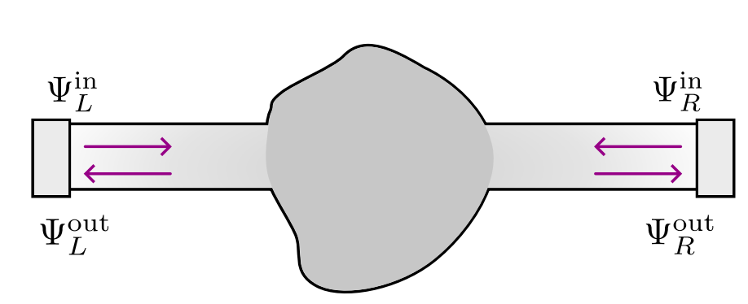{width=50%}

$$
S = \begin{pmatrix}
r_{LL} & t_{LR} \\
t_{RL} & r_{RR}
\end{pmatrix}
; \;
S S^\dagger = 1
$$

## Scattering theory of topological phases

Example: 1D topological superconductor

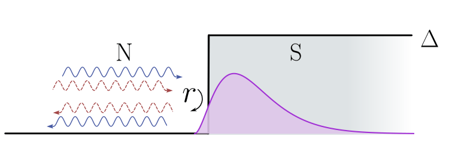{width=40%}

::: {.columns}
::: {.column width="60%"}

Current conservation: $rr^\dagger = 1 \implies \lvert \det r \rvert = 1$

Particle-hole symmetry: $r \in \mathbb{R} \implies \textrm{Im} \det r = 0$

Both constraints together:

$$
\mathcal{Q} = \det r = \pm 1 \in \mathbb{Z}_2
$$
:::

::: {.column width="40%"}
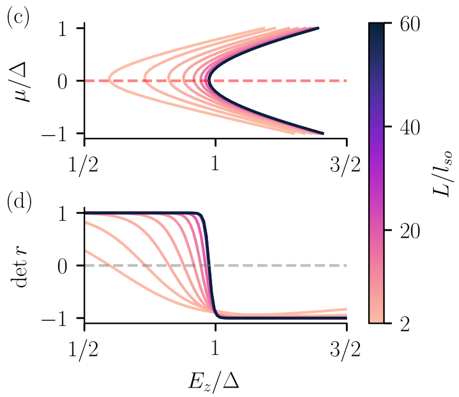{width=80%}

:::

:::

::: {.reference-stack}
[Fulga et al. (2011),]{.reference}
[Araya Day et al. (2025)]{.reference}

:::

## Scattering theory of topological phases

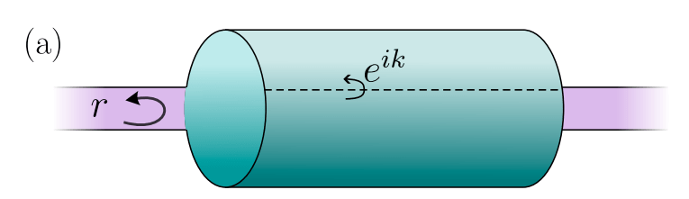{width=40%}

1D reflection matrix from 2D gapped Hamiltonian

**Recipe**:

- Start from d-dimensional $H_d(k_d)$
- Attach $d-1$ leads
- Close 2 dimensions with twisted boundary conditions
- Calculate $r(k_{d-1})$ of a gapped bulk
- Find the invariant of $r(k_{d-1})$

::: {.reference-stack}
[Fulga et al. (2011)]{.reference}

:::

## Scattering theory of topological phases

Example: 2D Chern insulator

::: {.columns}

::: {.column width="50%"}

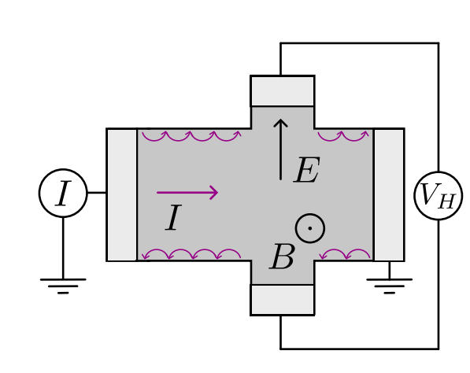{width=55%}

$$
C = \frac{1}{2\pi} \int_\textrm{BZ} d {k}^2 \textrm{tr} \nabla \times \mathcal{A}( k)
$$
:::
::: {.column width="50%"}

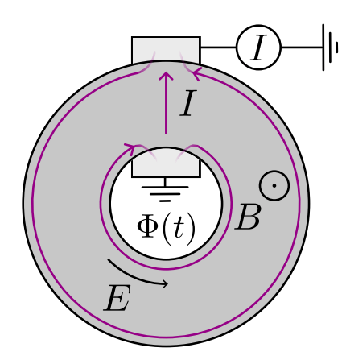{width=45%}

$$
C = \frac{1}{2\pi i} \int_0^{2\pi} d\Phi \frac{d}{d\Phi} \log \det r(\Phi)
$$
:::

:::
Scattering geometry is that of Laughlin's argument

::: {.reference-stack}
[Zijderveld et al. (2025)]{.reference}

:::

---

## Direct generalization does not work

Example: 2D second-order HOTI protected by $C_4$ and $\mathcal{C}$

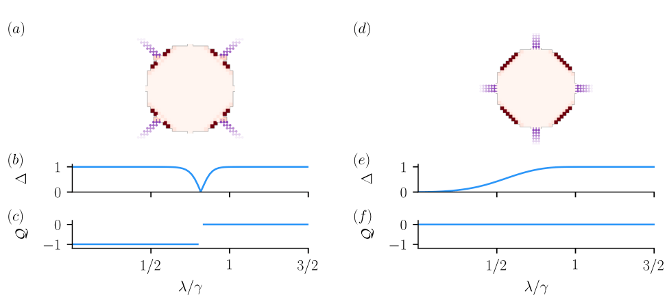{width=55%}

\

Problems with the invariant $\mathcal{Q} = \textrm{signature}(r)$:

- it does not use spatial symmetry
- it is sensitive to the leads location.

::: {.reference-stack}
[Zijderveld et al. (2025)]{.reference}

:::

# Scattering theory of higher order topological phases

A generalization to spatial symmetries

\

::: {.columns}

::: {.column width="50%"}
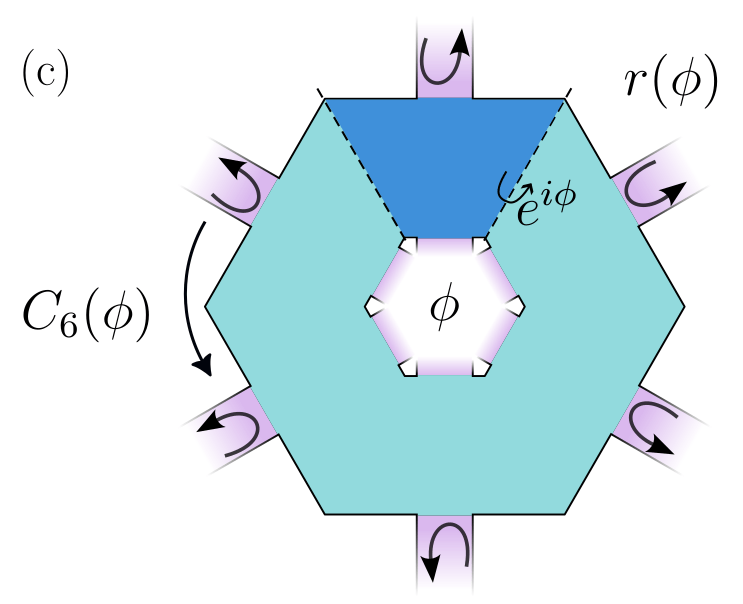{width=65%}
:::
::: {.column width="50%"}

**Recipe**:

- Construct symmetric sample
- Thread a flux
- Attach 2 symmetric leads
- Compute $r(k, ..., \phi)$
- Apply symmetry constraints
- Compute invariant on $r(k, ..., \phi)$
:::
:::

::: {.reference-stack}
[Zijderveld et al. (2025)]{.reference}

:::

## Example: 2D second-order TI

::: {.columns}

::: {.column width="50%"}
One constraint per symmetry: $C_4$ and $\mathcal{C}$

$$
r(\phi) = -V_{C_4} (\phi) r V_{C_4}^\dagger(\phi)
$$

$$
r(\phi) = r^\dagger(\phi)
$$

$$
\implies
r'(\phi) = \begin{pmatrix}
0 & h(\phi) \\
h^\dagger (\phi) & 0
\end{pmatrix}
$$

:::
:::{.column width="50%"}

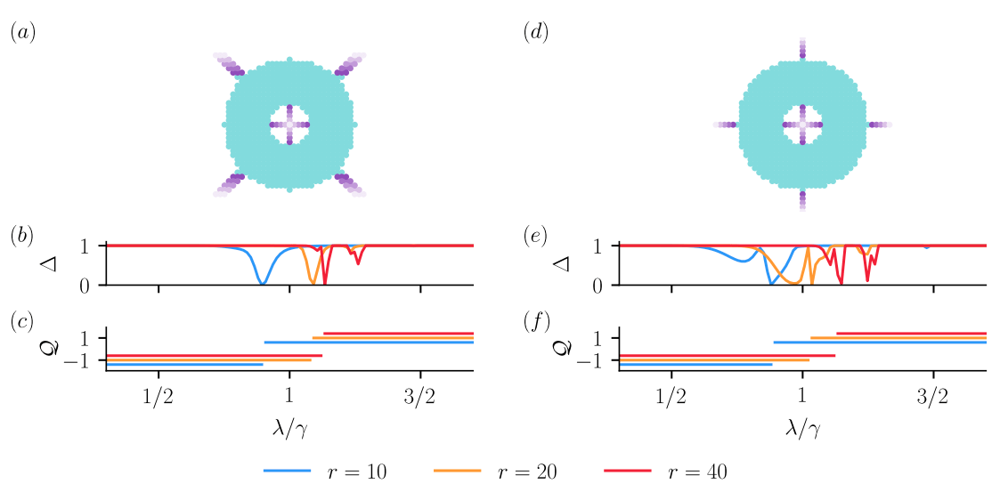{width=95%}
:::
:::

Scattering invariant:

$$
Q = \textrm{sign} ( \textrm{det}h(\phi) \textrm{exp} \left[\frac{1}{2} \int_{-\pi}^{\pi} d \textrm{log} \; \textrm{det}h(\phi) \right]) \in \mathbb{Z}_2
$$

::: {.reference-stack}
[Zijderveld et al. (2025)]{.reference}

:::

## Example: 3D second-order TI

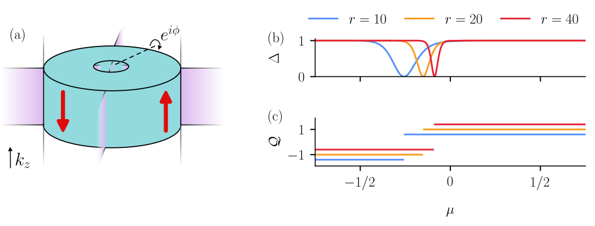{width=55%}

Protected by $C_4 \mathcal{T}$ and $\mathcal{P}$ such that $(C_4 \mathcal{T})^4 = -1$

$$
\mathcal{Q} = \frac{\textrm{Pf}[H_{\textrm{eff}}(0, \pi)]}{\textrm{Pf}[H_{\textrm{eff}}(0, 0)]} \exp \left[ -\frac{1}{2}\int_0^\pi d\log \; \det H_{\textrm{eff}}(0, k_z)
\right] \; \in \mathbb{Z}_2
$$

::: {.reference-stack}
[Zijderveld et al. (2025)]{.reference}

:::

## HOTIs response to flux

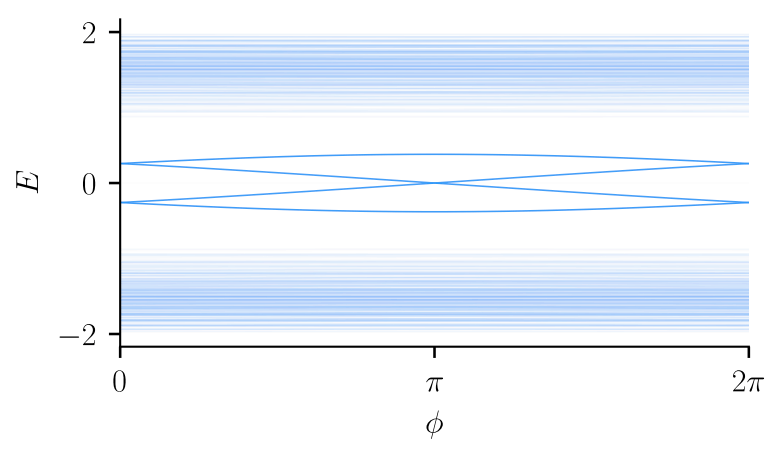{width=50%}

Flux captures spectral flow of modes at the surface

::: {.reference-stack}
[Zijderveld et al. (2025)]{.reference}
:::

---

::: {.full-screen-slide}
::: {.full-screen-question}
How much charge does the HOTI pump per symmetry sector?
:::
:::

# Summary and outlook

1. Determined how to construct HOTI scattering invariants
2. We can study phase transitions of HOTIs with disorder
3. We can compute quasicrystalline bulk invariants
4. We do not yet know how to write 3rd order HOTI invariants

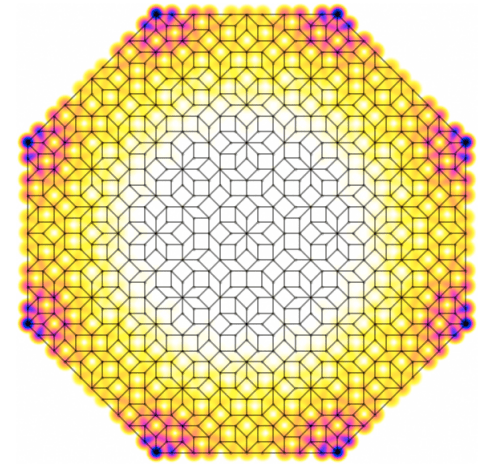{width=30%}
